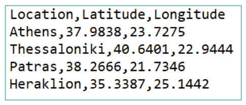
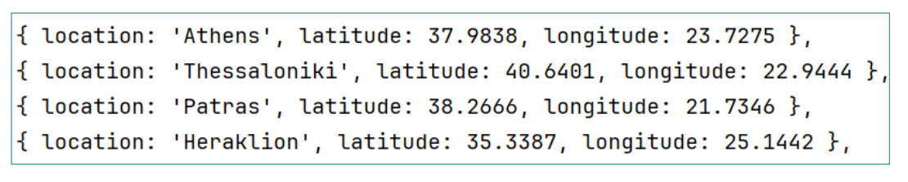

**Locations**  

Έστω ένα αρχείο locations.txt με τοποθεσίες, latitude και longitude. Αναπτύξτε ένα
πρόγραμμα που να διαβάζει και να γράφει σε ένα άλλο αρχείο με το συγκεκριμένο format.

Input

Output

**Αντιγραφή Binary**

Κάντε αντιγραφή ενός binary αρχείου το όνομα του οποίου θα εισάγει ο χρήστης και θα 
βρίσκεται σε ένα προκαθορισμένο φάκελο, έστω C:/tmp/ 

Η αντιγραφή θα γίνεται σε ένα νέο αρχείο με διαφορετικό
όνομα. Π.χ. Αν το αρχικό όνομα του αρχείου είναι το userInputFile,
τότε το νέο όνομα μπορεί να είναι outPath + UUID.randomUUID().toString().replace(":", "_") +
userInputFile; όπου το UUID.randomUUID() παράγει ένα νέο
τυχαίο Universal Unique ID το οποίο μετατρέπουμε σε String
με την toString() και στη συνέχεια αντικαθιστούμε το : με _
μιας και τα ονόματα αρχείων δεν μπορούν να περιέχουν :

